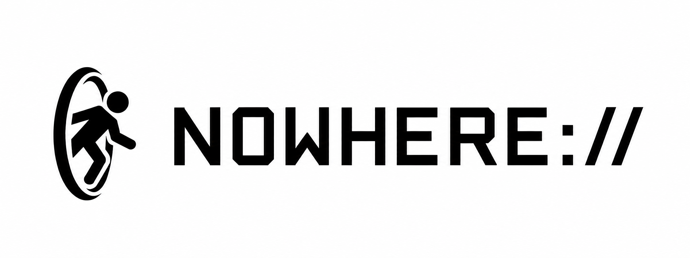

<p align="center">
  
</p>

<p align="center">
  <strong>One relay. Two carriers. Independent directions.</strong>
</p>

<p align="center">
  A cross-platform relay that composes TLS/TCP and QUIC/UDP<br>
  independently for every flow.
</p>

<p align="center">
  <a href="#how-it-works">Architecture</a> &middot;
  <a href="#quick-start">Quick start</a> &middot;
  <a href="#live-operations">Live operations</a> &middot;
  <a href="docs/README.md">Documentation</a> &middot;
  <a href="docs/protocol.md">Wire protocol</a>
</p>

Nowhere joins TLS/TCP and QUIC/UDP behind one service edge. **Vector** accepts
local SOCKS5 traffic; **Portal** authenticates carriers and reaches the target.
Each flow selects its uplink and downlink independently.

| Core property | What it means |
| --- | --- |
| Unified edge | TLS/TCP and QUIC/UDP share one identity and lifecycle |
| Split routing | Uplink and downlink choose their carrier independently |
| Optional Morph | A keyed transform masks the TLS/QUIC wire image |
| TCP and UDP | SOCKS5 CONNECT and UDP ASSOCIATE are both supported |
| Native chaining | Portal forwards directly to Portal with no local proxy loop |
| Built-in telemetry | The same binary discovers and inspects live instances |

## How it works

```text
 Application
  TCP / UDP
      |
    SOCKS5
      |
      v
+------------+  Uplink carrier   +--------------+  Native `next` uplink   +-------------+
|   Vector   |==================>| Entry Portal |========================>| Next Portal |
|            |<==================|              |<========================| (optional)  |
+------------+  Downlink carrier +--------------+  Native `next` downlink +-------------+
                                         |                                       |
                                 direct or SOCKS5                        direct or SOCKS5
                                         |                                       |
                                         v                                       v
                                  +------------+                          +------------+
                                  |   Target   |                          |   Target   |
                                  +------------+                          +------------+
```

Each service URL uses either a compact endpoint for both carriers on one port,
or an explicit endpoint that assigns carriers, ports, and address families.

| Endpoint | Meaning |
|---|---|
| `@*:2000` | TLS/TCP and QUIC/UDP wildcard candidates, port 2000 |
| `@*/tcp:2006` | TLS/TCP only, IPv4 and IPv6 |
| `@*/udp:2017` | QUIC/UDP only, IPv4 and IPv6 |
| `@*/tcp4:2006/udp6:2017` | TLS/TCP on IPv4 and QUIC/UDP on IPv6 |

`*` is reserved for Portal listeners; Vector and `next` require a concrete
address or hostname. On Portal, `@:2000` is shorthand for `@*:2000`. The full
grammar is documented in [Configuration](docs/configuration.md).

### Independent uplink and downlink

`up` and `down` accept `tcp`, `udp`, or `mix`. With both carriers available,
the default is TCP; `mux=1` enables TLS multiplexing.

| `up` ↓ / `down` → | `tcp` | `udp` | `mix` |
|---|---|---|---|
| `tcp` | TT | TQ | TT ↔ TQ |
| `udp` | QT | QQ | QT ↔ QQ |
| `mix` | TT ↔ QT | TQ ↔ QQ | TT ↔ QQ |

T is TLS/TCP and Q is QUIC/UDP, with uplink first. `mix` makes one 50/50 choice
per flow and may try the alternate route once before commitment. Portal
`next=` applies the same policy independently on each hop.

## Data path

Authentication belongs to each physical carrier; routing belongs to each
logical flow. Once Portal returns `READY`, application data travels as a plain
byte stream or QUIC DATAGRAM payload.

```text
Carrier bootstrap                 Logical flow

+----------------+                +----------------+----------+-------------+
| AuthFrame      |                | FlowHeader     | Target?  | Payload ... |
| 32 bytes       |                | 5 bytes        | variable | after READY |
+----------------+                +----------------+----------+-------------+
        |                                  |
        +-- TLS: dedicated lane or Mux     +-- TCP: reliable byte stream
        +-- QUIC: first stream only        +-- UDP: UoT or QUIC DATAGRAM
```

Frames are compact, queues are bounded, and hot-path buffers are reused. See
[Protocol](docs/protocol.md) for the wire contract and
[Security](docs/security.md) for trust boundaries.

### Morph

`morph=1` masks the bare TLS/QUIC wire image with a transform derived from the
shared key:

```text
TCP  client -> server   [ nonce 12B ][ ChaCha20-XOR(TLS stream) ]
     server -> client                [ ChaCha20-XOR(TLS stream) ]

UDP  each datagram      [ nonce 12B ][ ChaCha20-XOR(QUIC datagram) ]
```

Both endpoints on a hop must enable it. Morph is wire masking, with no protocol
camouflage or added security semantics. See [Protocol](docs/protocol.md).

### Native chaining

A Portal can open the next Nowhere hop directly:

```bash
nowhere \
  'portal://relay-key@:2000?next=origin-key@origin.example:2000&up=udp&down=udp'
```

`next` is lazy, mutually exclusive with outbound `socks`, and bounded to seven
hops.

## Quick start

Use a stable Rust toolchain on a supported target.

### 1. Build

```bash
cargo build --release --locked
```

### 2. Start Portal

Listen on TLS/TCP and QUIC/UDP at port `2000`:

```bash
./target/release/nowhere 'portal://change-me@127.0.0.1:2000'
```

### 3. Start Vector

Expose SOCKS5 on `127.0.0.1:1080`:

```bash
./target/release/nowhere \
  'vector://change-me@127.0.0.1:2000?up=tcp&down=tcp&socks=127.0.0.1:1080'
```

More examples are available in [Configuration](docs/configuration.md) and the
[extended quick start](docs/quick-start.md).

### 4. Inspect

Open the local TUI from another terminal:

```bash
./target/release/nowhere tui
```

## Live operations

<p align="center">
  
</p>

The read-only TUI discovers local Portal and Vector instances and presents
traffic, carrier, process, and log data without controlling their lifecycle.

## Public deployment

The local examples disable certificate verification by omitting `sni`. Public
deployments should use a trusted certificate and verified server name:

```bash
nowhere 'portal://change-me@:2000?tls=2&crt=/etc/nowhere/cert.pem&key=/etc/nowhere/key.pem'
nowhere 'vector://change-me@relay.example:2000?sni=relay.example&socks=127.0.0.1:1080'
```

Certificate pinning is also available. Review [Security](docs/security.md) and
[Configuration](docs/configuration.md) before exposing a Portal.

## Platform scope

Portal, Vector, relay, TUI, and discovery share the supported platform matrix;
process telemetry varies by operating system. See [Platforms](docs/platforms.md)
and [Operations](docs/operations.md).

## Documentation

The [documentation index](docs/README.md) covers configuration, protocol,
security, operations, platforms, and integrations.

## Development

Run the standard checks on a supported host:

```bash
cargo fmt --all -- --check
cargo test --all-targets --locked
cargo clippy --all-targets --locked -- -D warnings
cargo build --release --locked
```

On macOS, [Apple Container](https://github.com/apple/container) provides the
reusable Linux check environment:

```bash
./scripts/check-linux.sh
```

CI covers Linux, macOS, and Windows. Release packaging covers Linux GNU/musl on
x86-64 and AArch64, macOS on Apple Silicon, and Windows x86-64 MSVC. Protocol
changes must update the wire document and protocol vectors together.

## License

Nowhere is licensed under the [GNU General Public License v3.0](LICENSE).

---

© 2026 NodePassProject. All rights reserved.
