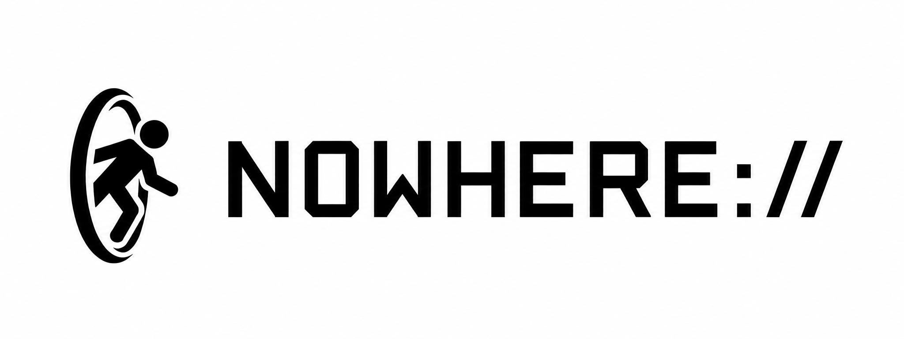

<p align="center">
  
</p>

<p align="center">
  <strong>One relay. Two carriers. Independent directions.</strong>
</p>

<p align="center">
  A cross-platform relay that composes TLS/TCP and QUIC/UDP<br>
  independently for every flow.
</p>

<p align="center">
  <a href="#quick-start">Quick start</a> &middot;
  <a href="#ecosystem">Ecosystem</a> &middot;
  <a href="#how-it-works">Architecture</a> &middot;
  <a href="#live-operations">Live operations</a> &middot;
  <a href="docs/README.md">Documentation</a> &middot;
  <a href="docs/protocol.md">Wire protocol</a>
</p>

Nowhere joins TLS/TCP and QUIC/UDP behind one service edge. **Vector** accepts
local SOCKS5 traffic; **Portal** authenticates carriers and reaches the target.
Each flow selects its uplink and downlink independently.

| Core property | What it means |
| --- | --- |
| Unified edge | TLS/TCP and QUIC/UDP share one service identity and lifecycle |
| Split routing | Uplink and downlink choose their carrier independently |
| Optional Morph | A keyed transform masks the TLS/QUIC wire image |
| TCP and UDP | SOCKS5 CONNECT and UDP ASSOCIATE are both supported |
| Native chaining | Portal forwards directly to Portal with no local proxy loop |
| Built-in telemetry | The same binary discovers and inspects live instances |

## Quick start

Use a stable Rust toolchain on a supported target, or download a
[prebuilt binary](https://github.com/NodePassProject/Nowhere/releases).

### 1. Build

```bash
cargo build --release --locked
```

### 2. Start Portal

Listen on TLS/TCP and QUIC/UDP at all interfaces on port `2000`:

```bash
./target/release/nowhere "portal://change-me@*:2000"
```

### 3. Start Vector

Connect to Portal and expose SOCKS5 on `127.0.0.1:1080`:

For the generated Portal certificate, replace `<sha256>` with the fingerprint
printed on the Portal host at startup:

```bash
./target/release/nowhere \
  "vector://change-me@portal.example:2000?up=tcp&down=tcp&pin=<sha256>&socks=127.0.0.1:1080"
```

### 4. Inspect

Open the local TUI from another terminal:

```bash
./target/release/nowhere tui
```

## Ecosystem

<table>
<tr>
<td width="50%" valign="top">
<sub>CLIENT</sub><br><br>
<strong><a href="https://github.com/NodePassProject/Anywhere">Anywhere</a></strong><br>
Native Swift client with independent TCP/UDP carriers, TLS multiplexing, and Morph.<br><br>
<a href="https://apps.apple.com/us/app/id6758235178">App Store</a>
</td>
<td width="50%" valign="top">
<sub>DEPLOY</sub><br><br>
<strong><a href="https://github.com/NodePassProject/nowhere-sh">nowhere-sh</a></strong><br>
Interactive Linux VPS deployment script for installation, upgrades, links, QR codes.<br><br>
<a href="https://github.com/NodePassProject/nowhere-sh#quick-start">Quick start</a>
</td>
</tr>
<tr>
<td width="50%" valign="top">
<sub>CONTROL</sub><br><br>
<strong><a href="https://github.com/NodePassProject/OpenCtrl">OpenCtrl</a></strong><br>
Supervises Nowhere processes and exposes their telemetry through REST and SSE.<br><br>
<a href="https://github.com/NodePassProject/OpenCtrl/blob/main/docs/master.md">API reference</a>
</td>
<td width="50%" valign="top">
<sub>OPERATE</sub><br><br>
<strong><a href="https://github.com/NodePassProject/NowhereDash">NowhereDash</a></strong><br>
Web dashboard managed through OpenCtrl, with live telemetry and protected subscriptions.<br><br>
<a href="https://github.com/NodePassProject/NowhereDash#quick-start">Quick start</a>
</td>
</tr>
</table>

## How it works

```text
 Application
  TCP / UDP
      |
    SOCKS5
      |
      v
+------------+  Uplink carrier   +--------------+  Native `next` uplink   +-------------+
|   Vector   |==================>| Entry Portal |========================>| Next Portal |
|            |<==================|              |<========================| (optional)  |
+------------+  Downlink carrier +--------------+  Native `next` downlink +-------------+
                                         |                                       |
                                 direct or SOCKS5                        direct or SOCKS5
                                         |                                       |
                                         v                                       v
                                  +------------+                          +------------+
                                  |   Target   |                          |   Target   |
                                  +------------+                          +------------+
```

### Endpoint format

Each service URL uses either a compact endpoint for both carriers on one port,
or an explicit endpoint that assigns carriers, ports, and address families.

| Endpoint | Meaning |
| --- | --- |
| `@*:2000` | TLS/TCP and QUIC/UDP on wildcard addresses, port 2000 |
| `@*/tcp:2006` | TLS/TCP only, IPv4 and IPv6 |
| `@*/udp:2017` | QUIC/UDP only, IPv4 and IPv6 |
| `@*/tcp4:2006/udp6:2017` | TLS/TCP on IPv4 and QUIC/UDP on IPv6 |

### Independent directions

`up` and `down` accept `tcp`, `udp`, or `mix`. With both carriers available,
the default is TCP; `mux=1` enables TLS multiplexing.

| `up` ↓ / `down` → | `tcp` | `udp` | `mix` |
| --- | --- | --- | --- |
| `tcp` | TT | TQ | TT ↔ TQ |
| `udp` | QT | QQ | QT ↔ QQ |
| `mix` | TT ↔ QT | TQ ↔ QQ | TT ↔ QQ |

T means TLS/TCP and Q means QUIC/UDP, with the uplink listed first. `mix`
randomly selects either carrier with equal probability for each flow and may
try the alternate route once before commitment. Portal `next=` applies the same
policy independently on each hop.

## Data path

```text
Carrier bootstrap                 Logical flow

+----------------+                +----------------+----------+-------------+
| AuthFrame      |                | FlowHeader     | Target?  | Payload ... |
| 32 bytes       |                | 5 bytes        | variable | after READY |
+----------------+                +----------------+----------+-------------+
        |                                  |
        +-- TLS: dedicated lane or Mux     +-- TCP: reliable byte stream
        +-- QUIC: first stream only        +-- UDP: UoT or QUIC DATAGRAM
```

### Morph

`morph=1` masks the bare TLS/QUIC wire image with a transform derived from the
shared key:

```text
TCP  client -> server   [ prelude 64B ][ nonce 12B ][ ChaCha20-XOR(TLS stream) ]
     server -> client                               [ ChaCha20-XOR(TLS stream) ]

UDP  each datagram      [ nonce 12B ][ ChaCha20-XOR(QUIC datagram) ]
```

### Native chaining

A Portal can open the next Nowhere hop directly:

```bash
nowhere \
  "portal://relay-key@:2000?next=origin-key@origin.example:2000&up=udp&down=udp"
```

`next` is lazy, mutually exclusive with outbound `socks`, and bounded to seven
hops.

## Live operations

<p align="center">
  
</p>

The read-only TUI discovers local Portal and Vector instances. It presents traffic,
carrier, process, and anonymized event data without controlling their lifecycle.
Third-party clients use the same [telemetry contract](docs/telemetry.md).

## Public deployment

Vector verifies system CA trust and the endpoint host by default. Public
deployments can use a CA-issued certificate without a pin:

```bash
nowhere "portal://change-me@:2000?tls=2&crt=/etc/nowhere/cert.pem&key=/etc/nowhere/key.pem"
nowhere "vector://change-me@portal.example:2000?socks=127.0.0.1:1080"
```

## Documentation

| Guide | Covers |
| --- | --- |
| [Quick start](docs/quick-start.md) | Build, run, and connect |
| [Ecosystem](docs/ecosystem.md) | Clients, deployment and control tools, and share links |
| [Configuration](docs/configuration.md) | Service URLs, options, chaining, and environment variables |
| [Wire protocol](docs/protocol.md) | Authentication, flows, Mux, and Morph |
| [Security](docs/security.md) | Certificate verification and trust boundaries |
| [Operations](docs/operations.md) | Deployment and runtime behavior |
| [Platforms](docs/platforms.md) | Supported targets and platform differences |
| [Telemetry](docs/telemetry.md) | Local discovery and monitoring integrations |

See the [documentation index](docs/README.md) for the complete reference.

## Development

Run the standard checks on a supported host:

```bash
cargo fmt --all -- --check
cargo test --all-targets --locked
cargo clippy --all-targets --locked -- -D warnings
cargo build --release --locked
```

On macOS, [Apple Container](https://github.com/apple/container) provides the
reusable Linux check environment:

```bash
./scripts/check-linux.sh
```

CI covers Linux, macOS, and Windows. Release packaging covers Linux GNU/musl on
x86-64 and AArch64, macOS on Apple Silicon, and Windows x86-64 MSVC. Protocol
changes must update the wire document and protocol vectors together.

## License

Nowhere is licensed under the [GNU General Public License v3.0](LICENSE).

---

© 2026 NodePassProject. All rights reserved.
